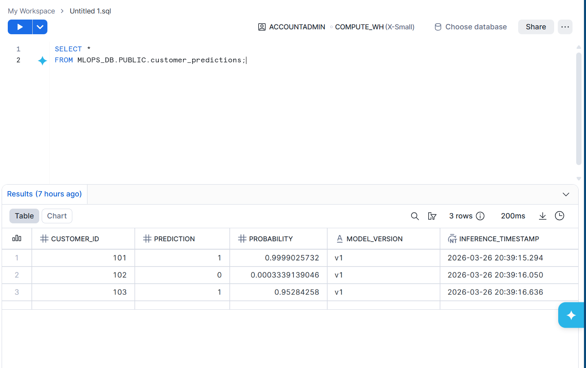
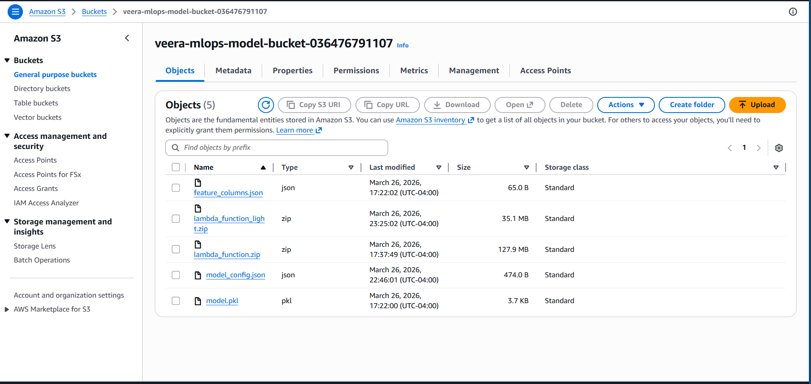
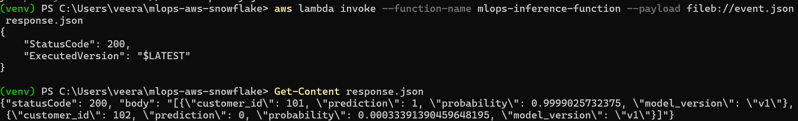

# Serverless MLOps Inference Pipeline with AWS Lambda, S3, and Snowflake

## Overview
This project demonstrates a lightweight MLOps workflow focused on model operationalization rather than model development. A churn prediction model is trained locally, exported into a lightweight model configuration, stored in Amazon S3, and used by an AWS Lambda function for inference. Snowflake is used for batch input and output of customer prediction data.

## Architecture
Snowflake customer feature data is read by a Python batch pipeline.  
The inference logic loads a lightweight model configuration from Amazon S3.  
AWS Lambda performs serverless prediction scoring.  
Prediction results are written back to Snowflake.

## Tech Stack
- Python
- AWS Lambda
- Amazon S3
- IAM
- Snowflake
- scikit-learn
- boto3
- snowflake-connector-python

## Workflow
1. Train a churn prediction model locally
2. Export model coefficients and feature mappings into a lightweight JSON config
3. Upload model config to Amazon S3
4. Deploy AWS Lambda inference function
5. Read customer feature data from Snowflake
6. Generate predictions
7. Write results back to Snowflake

## Key Features
- Serverless inference with AWS Lambda
- Model artifact management using Amazon S3
- Snowflake batch integration for input and output tables
- IAM-based secure access control
- Lightweight deployment design for Lambda compatibility

## Repository Structure
- `model/train_model.py` - trains the original model
- `model/export_model_config.py` - exports lightweight model parameters
- `model/model_config.json` - lightweight artifact used by Lambda
- `lambda_app/inference.py` - inference logic
- `lambda_app/handler.py` - Lambda handler
- `lambda_app/snowflake_io.py` - Snowflake read/write utilities
- `run_pipeline.py` - local batch scoring pipeline
- `test_local.py` - local inference test

## Current Working Flows
### 1. Snowflake Batch Pipeline
Snowflake `customer_features` → local Python pipeline → predictions written to Snowflake `customer_predictions`

### 2. AWS Lambda Inference
Input payload → AWS Lambda → model config loaded from S3 → prediction response returned

## Known Limitation
Direct Snowflake connectivity inside AWS Lambda was not finalized in this version because the Snowflake connector package built on Windows was not compatible with the Linux Lambda runtime. To keep the deployment lightweight and functional, Snowflake integration is handled through a Python batch pipeline outside Lambda.

## Outcome
This project demonstrates how to operationalize a trained machine learning model using AWS Lambda, Amazon S3, and Snowflake in a production-style workflow.

## Screenshot

## AWS S3 Artifacts

## AWS Lambda Successful Invoke

